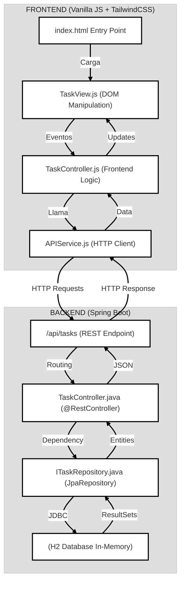
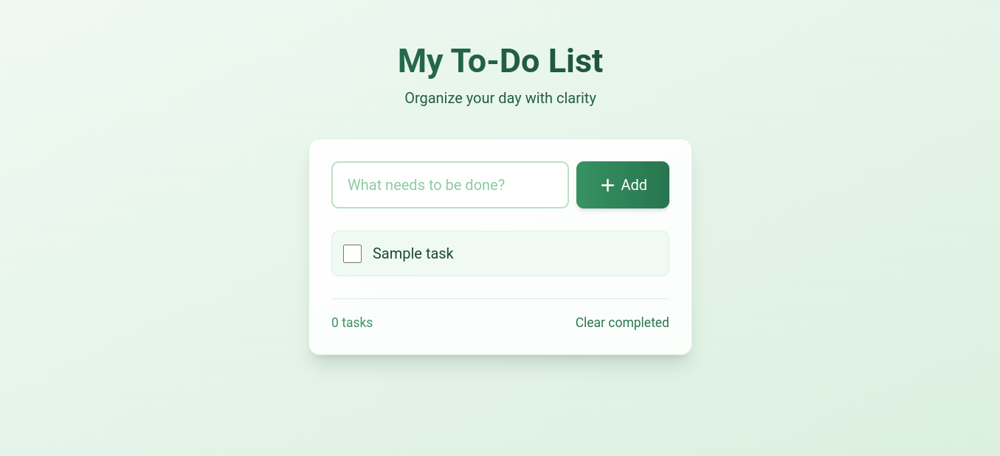

# todo-list Project


## Table of Contents
- [Overview](#overview)
- [Getting Started](#getting-started)
  - [Prerequisites](#prerequisites)
  - [Installation](#installation)
- [Running the Project](#running-the-project)
- [Project Structure](#project-structure)
- [Architecture](#architecture-diagram)
- [Screenshot](#screenshot)

---

## Overview

This Todo-List application combines **Spring Boot** for the backend and **pure JavaScript** for the frontend. The app implements all CRUD operations (Create, Read, Update, Delete) and features a modern design thanks to **Tailwind CSS**.

---

## Getting Started

### Prerequisites
Ensure you have the following installed:
| Prerequisite                      | Details                                                                  |
| :-------------------------------- | :----------------------------------------------------------------------- |
| **Java Development Kit (JDK)** | Version 17 or higher.                                                    |
| **Web Browser** | A modern browser like Chrome, Firefox, or Edge.                          |
| **Maven** | (Optional) The project includes a Maven Wrapper (`mvnw` and `mvnw.cmd`), so a separate Maven installation isn't strictly necessary. |

### Installation
To get a copy of the project up and running on your local machine, follow these steps:

-  **Clone the repository HTTPS:**
    ```bash
    git clone https://github.com/krjofficial/springboot-todo.git
    ```
---

## Running the Project

### Backend

Once you've installed the project, you can run it as follows:

1.  **Ensure you are in the `backend_todo_list` directory:**
    ```bash
    cd todo-list-springboot-tailwind
    cd backend_todo_list
    ```
2.  **Execute the Spring Boot application:**
    * **For Windows:**
        ```bash
        mvnw.cmd spring-boot:run
        ```
    * **For Linux/macOS:**
        ```bash
        ./mvnw spring-boot:run
        ```
3.  **Access the application:**
    The backend will start on port 8080: **API Base URL** `http://localhost:8080/api/tasks`.

### Frontend
-  **Option A: Run the Frontend (Vanilla JS).**
    Simply open the index.html file in your browser
    From project root:
    ```
    open frontend_todo_list/index.html  # Linux/macOS
    start frontend_todo_list/index.html # Windows
    ```
-   Or manually navigate to the file in your file explorer
-   **Option B: Local HTTP Server.**
    Navigate to your frontend directory
    ```
    python -m http.server 8000  # Linux/macOS/Windows
    ```
    Then open: http://localhost:8000 (or the port shown in terminal)


---

## Project Structure

The project is organized into `backend` and `frontend` directories:

```
├── backend_todo_list/                 # Spring Boot Backend
│   ├── src/main/java/com/todo/todo_list/
│   │   ├── controller/                # REST Controller
│   │   ├── model/                     # JPA Entity
│   │   ├── repository/                # Data Repository
│   │   └── TodoListApplication.java   # Main Application Class
│   └── resources/application.properties # H2 DataBase Configuration
│
└── frontend_todo_list/                # Frontend JavaScript
    ├── src/
    │   ├── controllers/               # UI Control Logic
    │   ├── services/                  # API Communication
    │   └── views/                     # UI Components
    └── index.html                     # Entry Point
```

---

## Architecture Diagram


## Screenshot

